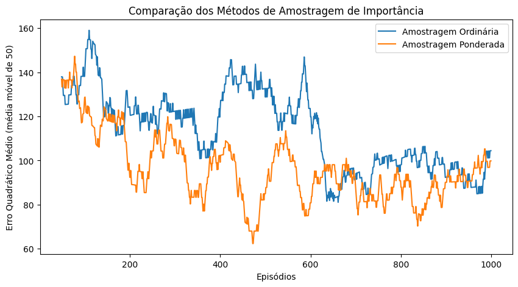
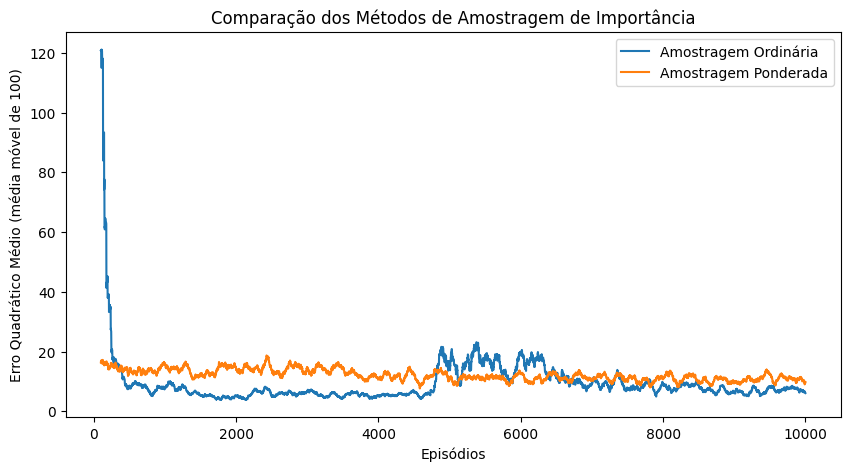

# Monte Carlo Off-Policy

**Aluno:** Apolo V. A. A. Albuquerque\
**Arquivo:** `Monte_Carlo_Off_Policy.ipynb` é o Notebook Python com código e resultados que foram produzidos\
**Vídeo:** [https://youtu.be/UI-DILkH5hQ](https://youtu.be/UI-DILkH5hQ)

## O que é Off-Policy?

Off-policy é um paradigma de aprendizado por reforço onde a função de valor de uma política alvo $\pi$ é aprendida utilizando trajetórias geradas por uma política diferente, chamada de política de comportamento $b$. Isso contrasta com o aprendizado on-policy, onde a mesma política é utilizada tanto para gerar experiências quanto para o aprendizado. Esse método é particularmente útil para aproveitar experiências passadas ou coletadas por agentes diferentes.

## Ambiente e Políticas

O ambiente utilizado é o *Cliff Walking* da biblioteca Gymnasium, modificado com um *wrapper* para limitar a quantidade de passos por episódio, truncando-o quando esse limite é atingido.

### Exemplo de Políticas

- **Política $\pi$ épsilon-greedy derivada da política ótima:** Escolhe a melhor ação na maioria das vezes, mas com uma pequena probabilidade $\varepsilon$ escolhe uma ação aleatória.
- **Política completamente aleatória:** Escolhe qualquer ação com probabilidade uniforme.

## Problema de Predição da RL

O problema de predição envolve estimar a função de valor $V(s)$ de uma política $\pi$, sem necessariamente aprender a própria política. Em um contexto on-policy, isso ocorre executando a própria $\pi$ para coletar experiências. No contexto off-policy, aprendemos $V(s)$ de $\pi$ usando amostras geradas por $b$, que pode ser muito diferente de $\pi$.

A função $V(s)$ é definida como o retorno esperado a partir de um estado $s$, seguindo a política $\pi$:

$V(s) = E[G_t | S_t = s]$

Ela é usada para avaliar quão "bom" é cada estado sob a política $\pi$.

A tabela abaixo apresenta os valores reais da função de valor $V(s)$ para a política target:


| Col 0  | Col 1  | Col 2  | Col 3  | Col 4  | Col 5  | Col 6  | Col 7 | Col 8 | Col 9 | Col 10 | Col 11 |
| ------ | ------ | ------ | ------ | ------ | ------ | ------ | ----- | ----- | ----- | ------ | ------ |
| -14.50 | -13.45 | -12.39 | -11.33 | -10.30 | -9.28  | -8.24  | -7.23 | -6.23 | -5.19 | -4.19  | -3.14  |
| -14.00 | -13.01 | -12.11 | -11.05 | -9.69  | -8.51  | -7.47  | -6.38 | -5.29 | -4.27 | -3.17  | -2.11  |
| -23.55 | -22.55 | -20.46 | -18.47 | -16.52 | -14.39 | -12.17 | -9.94 | -7.73 | -5.50 | -3.35  | -1.06  |
| -25.45 | 0.00   | 0.00   | 0.00   | 0.00   | 0.00   | 0.00   | 0.00  | 0.00  | 0.00  | 0.00   | 0.00   |

## Importance Sampling

O *importance sampling* é usado para ajustar as estimativas de retorno quando as amostras foram geradas sob uma política diferente da que está sendo avaliada.

### Fórmulas

#### *Ordinary Importance Sampling*

$V(s) = \frac{\sum_{t \in T(s)} \rho_{t:T(t)-1} G_t}{|T(s)|}$

#### *Weighted Importance Sampling*

$V(s) = \frac{\sum_{t \in T(s)} \rho_{t:T(t)-1} G_t}{\sum_{t \in T(s)} \rho_{t:T(t)-1}}$

### Explicação das Fórmulas

Conforme explicado no livro *Reinforcement Learning: An Introduction*, de Richard S. Sutton e Andrew G. Barto:

- No *Ordinary Importance Sampling*, cada retorno $G_t$ é ponderado pelo produto dos fatores de importância $\rho_{t:T(t)-1}$, e a média é feita dividindo-se pelo número de trajetórias $|T(s)|$ que iniciam no estado $s$. Essa abordagem pode apresentar alta variância.
- No *Weighted Importance Sampling*, a normalização é feita dividindo pelo somatório dos próprios fatores de importância. Isso reduz a variância das estimativas, proporcionando convergência mais estável, embora possa introduzir certo viés.

## Pseudo-Código do Algoritmo

```plaintext
Iniciar returns_history, errors e contadores
Para cada episódio:
    Reiniciar o ambiente e obter o estado inicial
    Inicializar lista episode_data
    Enquanto o episódio não terminar:
        Escolher ação a a partir da behavior_policy
        Obter probabilidades da target_policy
        Executar ação e registrar estado, ação, recompensa e probabilidades
    Inicializar G = 0 e ρ = 1
    Criar conjunto updated_states
    Para cada passo t da trajetória, de s_T a s_0:
        Atualizar G com a recompensa e fator de desconto
        Atualizar ρ multiplicando pela razão π(a|s) / b(a|s)
        Armazenar (ρ, G) em returns_history[s]
        Adicionar s ao conjunto updated_states
        Se stop_buildup e ação de b for diferente da melhor ação de π, parar
    Para cada estado s em updated_states:
        Se weighted:
            Calcular V(s) como soma(ρG) / soma(ρ)
        Caso contrário:
            Calcular V(s) como média dos retornos ponderados por ρ
    Calcular erro quadrático médio (MSE) e armazenar em errors
Consolidar V(s) final baseado nos retornos acumulados
Retornar V_final e errors
```

O parâmetro `stop_buildup` impede que o acúmulo de $G$ e $\rho$ continue caso a política de comportamento tenha escolhido uma ação diferente da target.

## Resultados dos Experimentos

Os experimentos comparam os valores reais de $V(s)$ da política target com as estimativas obtidas pelos métodos *ordinary* e *weighted importance sampling*. Os experimentos rodados com o `stop_buildup=False` demoraram mais para serem rodados e geram um gráfico parecido a partir de uma quantidade grande de episódios indicando uma certa estabilidade/resposta final. Nos casos com `stop_buildup=True`, o código roda mais rápido pois sempre haverá cálculos que não serão feitos caso a política behaviour não escolha o mesma ação da target, e tendo em vista que estamos rodando uma política behaviour 100% aleatória, os gráficos gerados são sempre diferentes a cada execução do código. Apesar disso, todos os gráficos tendem os valores dos erros para 0 atráves dos episódios, o que indica que o algoritmo, ao longo do tempo, está estimando $V(s)$ corretamente.

### Experimento 1: 1000 episódios com `stop_buildup=True`

#### Gráfico Comparativo dos MSE


#### Tabelas de Resultados

##### V\_target:

| Col 0  | Col 1  | Col 2  | Col 3  | Col 4  | Col 5  | Col 6  | Col 7 | Col 8 | Col 9 | Col 10 | Col 11 |
| ------ | ------ | ------ | ------ | ------ | ------ | ------ | ----- | ----- | ----- | ------ | ------ |
| -14.50 | -13.45 | -12.39 | -11.33 | -10.30 | -9.28  | -8.24  | -7.23 | -6.23 | -5.19 | -4.19  | -3.14  |
| -14.00 | -13.01 | -12.11 | -11.05 | -9.69  | -8.51  | -7.47  | -6.38 | -5.29 | -4.27 | -3.17  | -2.11  |
| -23.55 | -22.55 | -20.46 | -18.47 | -16.52 | -14.39 | -12.17 | -9.94 | -7.73 | -5.50 | -3.35  | -1.06  |
| -25.45 | 0.00   | 0.00   | 0.00   | 0.00   | 0.00   | 0.00   | 0.00  | 0.00  | 0.00  | 0.00   | 0.00   |

##### V\_ordinary:

| Col 0  | Col 1  | Col 2  | Col 3  | Col 4  | Col 5  | Col 6  | Col 7 | Col 8 | Col 9 | Col 10 | Col 11 |
| ------ | ------ | ------ | ------ | ------ | ------ | ------ | ----- | ----- | ----- | ------ | ------ |
| -15.29 | -28.95 | -10.26 | -24.68 | -8.56  | -19.67 | -2.88 | -1.32 | -0.04 | -0.86 | -0.18  | -0.04  |
| -9.91  | -4.71  | -3.00  | -1.92  | -0.36  | -4.61  | -4.76 | -3.88 | -0.04 | -0.04 | -3.88  | -3.88  |
| -4.61  | -4.03  | -22.06 | -12.02 | -52.31 | -8.52  | -0.89 |  N/V  | -3.94 | -0.31 |  N/V   |  N/V   |
| -10.12 |  N/V   |  N/V   |  N/V   |  N/V   |  N/V   |  N/V  |  N/V  |  N/V  |  N/V  |  N/V   |  N/V   |

##### V\_weighted:

| Col 0  | Col 1  | Col 2  | Col 3  | Col 4  | Col 5  | Col 6  | Col 7 | Col 8 | Col 9 | Col 10 | Col 11 |
| ------ | ------ | ------ | ------ | ------ | ------ | ------ | ----- | ----- | ----- | ------ | ------ |
| -1.66 | -1.29 | -1.84 | -1.26 | -1.52 | -1.17 | -1.07 | -1.01 | -1.80 | -1.00 |  N/V   |  N/V   |
| -3.06 | -2.44 | -1.68 | -2.35 | -1.70 | -1.79 | -1.00 | -1.66 | -3.75 |  N/V  |  N/V   |  N/V   |
| -4.21 | -3.58 | -4.98 | -2.63 | -2.48 | -1.89 | -8.14 | -2.49 | -4.03 | -3.00 | -2.00  | -1.00  |
| -2.96 |  N/V  |  N/V  |  N/V  |  N/V  |  N/V  |  N/V  |  N/V  |  N/V  |  N/V  |  N/V   |  N/V   |

> O objetivo de mostrar as tabelas acima é comparar os valores reais da $V(s)$ da política target com as estimativas obtidas pelos métodos ordinary e weighted. **N/V** é "não visitado", o que indica que, durante a execução dos episódios, o determinado estado nunca foi visitado.

### Experimento 2: 1000 episódios com `stop_buildup=False`

#### Gráfico Comparativo dos MSE



#### Tabelas de Resultados

##### V\_target:

| Col 0  | Col 1  | Col 2  | Col 3  | Col 4  | Col 5  | Col 6  | Col 7 | Col 8 | Col 9 | Col 10 | Col 11 |
| ------ | ------ | ------ | ------ | ------ | ------ | ------ | ----- | ----- | ----- | ------ | ------ |
| -14.50 | -13.45 | -12.39 | -11.33 | -10.30 | -9.28  | -8.24  | -7.23 | -6.23 | -5.19 | -4.19  | -3.14  |
| -14.00 | -13.01 | -12.11 | -11.05 | -9.69  | -8.51  | -7.47  | -6.38 | -5.29 | -4.27 | -3.17  | -2.11  |
| -23.55 | -22.55 | -20.46 | -18.47 | -16.52 | -14.39 | -12.17 | -9.94 | -7.73 | -5.50 | -3.35  | -1.06  |
| -25.45 | 0.00   | 0.00   | 0.00   | 0.00   | 0.00   | 0.00   | 0.00  | 0.00  | 0.00  | 0.00   | 0.00   |

##### V\_ordinary:

| Col 0  | Col 1  | Col 2  | Col 3  | Col 4  | Col 5  | Col 6  | Col 7 | Col 8 | Col 9 | Col 10 | Col 11 |
| ------ | ------ | ------ | ------ | ------ | ------ | ------ | ----- | ----- | ----- | ------ | ------ |
| -1.90 | -0.66 | -0.97 | -0.49 | -0.35 | -0.27 | -0.09 | -0.01 | -0.41 | -1099.67 | -226.63 | -45.04 |
| -0.17 | -0.69 | -4.09 | -2.05 | -0.69 | -0.38 | -0.55 | -0.30 | -0.02 |  -42.45  |  -2.47  | -30.11 |
| -0.87 | -0.67 | -0.54 | -0.44 | -0.15 | -0.45 | -0.30 | -5.99 | -2.32 |  -0.70   |  -0.00  | -1.94  |
| -0.73 |  N/V  |  N/V  |  N/V  |  N/V  |  N/V  |  N/V  |  N/V  |  N/V  |   N/V    |   N/V   |  N/V   |

##### V\_weighted:

| Col 0  | Col 1  | Col 2  | Col 3  | Col 4  | Col 5  | Col 6  | Col 7 | Col 8 | Col 9 | Col 10 | Col 11 |
| ------ | ------ | ------ | ------ | ------ | ------ | ------ | ----- | ----- | ----- | ------ | ------ |
| -2.54  | -2.13  | -3.42 | -2.52 | -1.56 | -2.39  | -1.43  | -1.21  | -2.88  | -1.06 | -1.00  |  N/V   |
| -2.25  | -2.12  | -2.56 | -3.18 | -2.93 | -2.63  | -2.31  | -2.14  | -2.99  | -2.02 | -1.00  | -2.02  |
| -13.85 | -12.68 | -5.44 | -5.57 | -2.78 | -56.74 | -19.14 | -99.31 | -96.28 | -4.58 | -8.00  | -3.04  |
| -12.55 |  N/V   |  N/V  |  N/V  |  N/V  |  N/V   |  N/V   |  N/V   |  N/V   |  N/V  |  N/V   |  N/V   |

> O objetivo de mostrar as tabelas acima é comparar os valores reais da $V(s)$ da política target com as estimativas obtidas pelos métodos ordinary e weighted. **N/V** é "não visitado", o que indica que, durante a execução dos episódios, o determinado estado nunca foi visitado.

### Experimento 3: 10 Execuções de 1000 episódios com `stop_buildup=False`

#### Gráfico Comparativo dos MSE


Neste experimento foi tirada a média de erros entre os 1000 episódios das 10 execuções.

### Experimento 4: 10 Execuções de 10000 episódios com `stop_buildup=True`

#### Gráfico Comparativo dos MSE


Neste experimento foi tirada a média de erros entre os 10000 episódios das 10 execuções.

### Experimento 5: 10 Execuções de 1000 episódios com `stop_buildup=False` e o ambiente com time limit maior (`max_steps=100`)

#### Gráfico Comparativo dos MSE


Neste experimento foi tirada a média de erros entre os 1000 episódios das 10 execuções. O gráfico ficou muito parecido com o do experimento 3.

### Experimento 6: 10 Execuções de 10000 episódios com `stop_buildup=True` e o ambiente com time limit maior (`max_steps=100`)

#### Gráfico Comparativo dos MSE



Neste experimento foi tirada a média de erros entre os 10000 episódios das 10 execuções.

## Referências

- *Reinforcement Learning: An Introduction, Richard S. Sutton e Andrew G. Barto*;
- Material Didático do professor Pablo Sampaio;
- [Documentação da Biblioteca Gymnasium](https://gymnasium.farama.org/api).